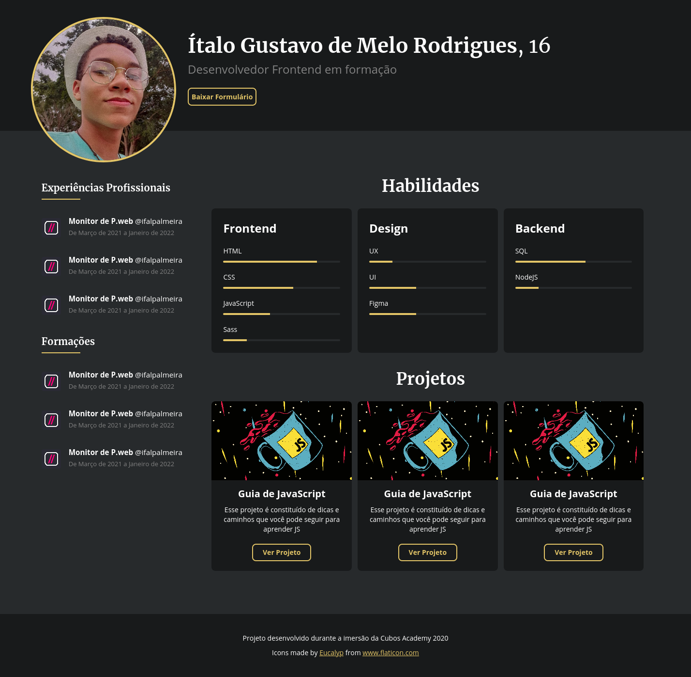

<p align="center">
    <a href="#-projeto">🖥 Projeto</a>&nbsp;&nbsp;&nbsp;|&nbsp;&nbsp;&nbsp;
    <a href="#-tecnologias">👨‍💻 Tecnologias</a>&nbsp;&nbsp;&nbsp;|&nbsp;&nbsp;&nbsp;
    <a href="#-projeto">🎨 Layout</a>&nbsp;&nbsp;&nbsp;|&nbsp;&nbsp;&nbsp;
    <a href="#-executar-o-projeto">🖇 Execução do Projeto</a>&nbsp;&nbsp;&nbsp;|&nbsp;&nbsp;&nbsp;
    <a href="#-licença">📃 Licença</a>&nbsp;&nbsp;&nbsp;|&nbsp;&nbsp;&nbsp;
    <a href="#-observações">📌 Observações</a>
</p>
<div align="center">
    
</div>


## 🖥 Projeto
O projeto é um **Portfólio** desenvolvido como desafio do @iuricode. É uma página completa, com informações essênciais para apresentar uma pessoa, seus projetos e sua conquistas. **Os exemplos desse projeto são fictícios**.

## 👨‍💻 Tecnologias
As tecnologias usadas nesse projeto foram:
- [HTML](https://developer.mozilla.org/en-US/docs/Web/HTML)
- [CSS](https://developer.mozilla.org/en-US/docs/Web/CSS)
- [Sass](https://sass-lang.com/)

## 🎨 Layout
Link para o design do projeto: [Portfólio](https://www.figma.com/file/OFPmaR4BYJd7QeChEOzHgL/Desafios---Codelândia-(Copy)?node-id=13190%3A2)
## 🖇 Executar o Projeto
Para executar o projeto, apenas é preciso clonar ele em seu dispositivo:

- Clone o repositório
    ```bash
    $ git clone git@github.com:Yta-ux/portfolio.git
    ```

##  📃 Licença
Esse projeto possui licença MIT. Para mais detalhes consulte o arquivo [LICENSE](LICENSE.md)

## 📌 Observações
- Projeto totalmente responsivo;
- Desafio promovido pelo [iuricode](https://github.com/iuricode);
